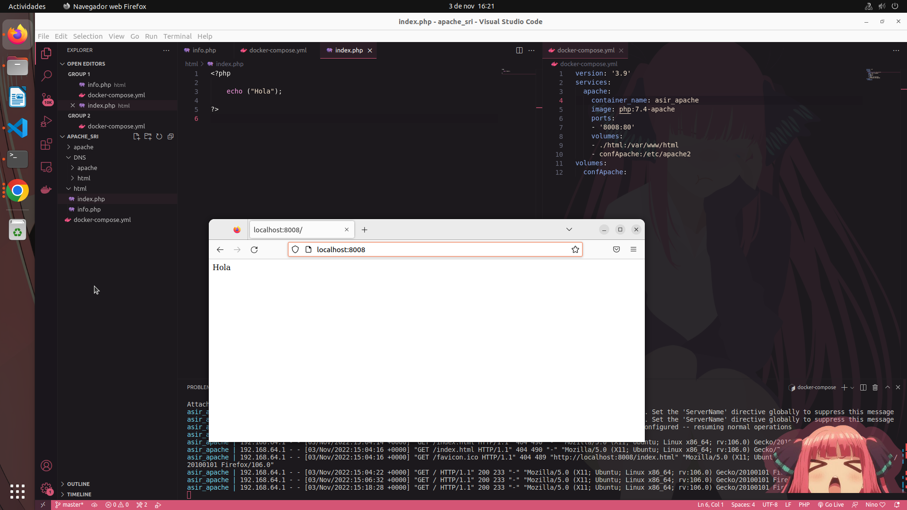

# Proyecto Apache  

*Por: Mateo Manuel González Ulla  
Curso: 2º ASIR  
Fecha: 03/11/2022  
Centro: Daniel Castelao*

## Creación de docker-compose.yml y demás recursos  

Lo primero que deberemos crear será el README.md y el docker-compose.yml, seguido del resto de carpetas y archivos que vayamos a utilizar (en este caso index.php e info.php). Para configurar el docker-compose.yml deberemos: 
- Definir la versión (3.9)
- Definir la imagen (Apache en este caso)
- Definir el nombre del contenedor (asir_apache)
- Mapear los puertos (utilizo el 8008 porque el 80 crea conflicto con otros proyectos)
- Mapear los volúmenes

~~~
version: '3.9'
services:
  apache:  
    container_name: asir_apache 
    image: php:7.4-apache
    ports:
    - '8008:80'
    volumes:  
    - ./html:/var/www/html
    - confApache:/etc/apache2
volumes:
  confApache:
~~~

**Es necesario** asignarle a la carpeta /usr/local/aoache/htdocs una carpeta local para poder mapear el documento raíz.

Para conseguir mostrar por pantalla la frase "Hola mundo" **es necesario** crear un index.php en la carpeta local mapeada anteriormente.

El documento index.php debe contener lo siguiente:

~~~
<?php
echo "Hello World! :)"; <!-- Imprime el texto por pantalla -->
?>
~~~

Para utilizar la opción phpinfo deberemos crear otro documento llamado info.php que contendrá el siguiente códgo:

~~~
<?php
phpinfo(); <!-- Enseña la información de php -->
?>
~~~

Para poder visualizar el contenido deberemos dirigirnos a la página "localhost:puerto/info.php" (en mi caso "localhost:8008/info.php")

¿Qué te parece, @damiancastelao? :+1:
